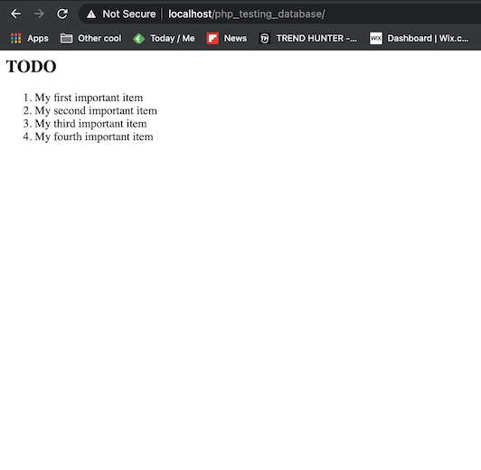
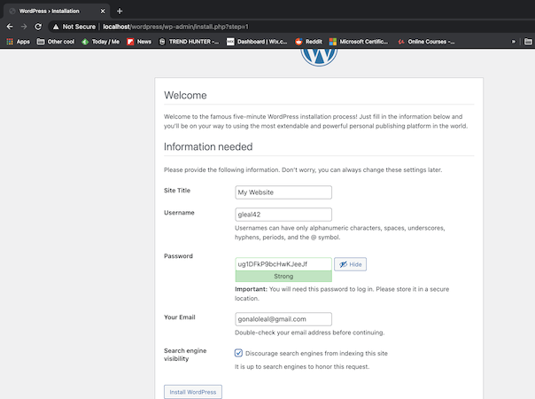
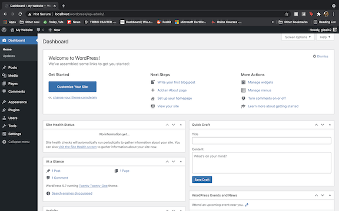

# ft_server

In this project we are asked to setup a Nginx webserver inside a single Docker container.

If you have Docker installed on your computer you can just git clone, navigate to the Dockerfile directory inside terminal and type the following command:

`bash run_containers.sh`

It will run a script to create an image and run a container with that image.

In that image we will specify that inside our container we install all the necessary softwae, with the necessary configurations in order to have our server working.

After we run that script we can simply go to the browser, type localhost and we will see an Index with all the files we can access (Homepage, phpMyAdmin, Wordpress and other files I created to test the different components.

Once we're done we can clean the container typing:
`bash clean_containers.sh`

For a better clean up we should remove the "#" inside the clean_containers.sh file.

But you may notice a problem. If you remove the container and restart it the website you have created is gone.

If you want to use this to develop your website in Wordpress and keep all the plugins and websites installed permanently then run:
`bash run_volume.sh` this will create a copy of the plugin and website data on our computer (outside the container).

If you want to delete this information because you think it is taking up too much space just run (remember, this will delete your Wordpress created website):
`bash clean_volumes.sh`

### Features of our Server

- Built on top of **Linux Debian:buster** (latest version at the moment)
- Ability to store backend data in **MySQL database**
- **phpMyAdmin** database administrator
- **Wordpress**
- Use of **SSL** Protocol (redirection from http to https)
- Apply autoindex (See tree structure of phpMyAdmin and Wordpress)

A great explanation of each of these features were given by [Ji Woo Lee](https://velog.io/@ljiwoo59/ftserver#wordpress)

## Understanding Docker

For this project I recommend first following a [Docker tutorial](https://www.youtube.com/watch?v=fqMOX6JJhGo).

This one was suggested by [Dimitri](https://github.com/DimitriDaSilva) and it is a great overview (from instalation to images, containers, ports... basically everything you need to know. Don't forget to do their Docker Labs Exercises to get comfortable with Docker).

### After watching that tutorial, the main takeaways that I got were:

- Applications are complex. They need different pieces of software for their different features (example Nginx for the server, Mariadb for the mysql databases, PHP 7.3 to read the .php files).
- These pieces of software can have different versions that need to be compatible among each other.
- Not only that but different operating systems have different native commands and compatibility needs.

### - How does Docker help with these issues:

  - It works like a mini Linux Kernel Virtual Machine that allows us to specify different Linux based Operating Systems (Debian, Ubuntu, ...) without having to install a Virtual Machine (Virtual Machines take up many Gbs worth of space and Ubuntu Docker Image takes MBs worth of space).
 
  - The Container is isolated from the host machine. This means that if you start a container, go inside it using the `run -it imagename` all the software that you install will be installed inside that container. When you remove the container you are sure that everything you installed inside is also removed.

  - Building an complex image is really fast. Especially in the consecutive times you build them. Docker stores cache data about the images that you built previously in the dockerfile so if you make changes to any part of your software and you rebuild the image it will load extremely fast.

- Imagine you have installed the latest version of Homebrew 3.0.11 but to deploy a particular application you need an older version 2.7.1 to install an old software. You don't need to unninstall your Homebrew, download the old one to deploy the application and then redownload the updated version when you're done. You can just create a dockerfile, install homebrew 2.7.1 and deploy the application and then remove the container when you're done.

- So we just need to follow this logic for all the software components we're using.
  - To deploy our server we need Debian:Buster Operating system, Nginx Web server, and we need relatively recent mySQL and PHP versions in order to be compatible with the current Wordpress requirements.

## - Implementation

To better understand each component we're installing this is the roadmap I suggest following:

1. Install Nginx with SSL/https
2. Try replacing the default Nginx webpage
3. Install MariaDB - Create and Show a database
4. Install PHP - Show PHP info page
5. Create PHP page connected to Database
6. Install phpMyAdmin (which is also a PHP page connected to our databases)
7. Install Wordpress
8. Create 2 different config files one with autoindex on and other with autoindexoff and a sh file to switch between them.

### The best resources for the implementation were:

#### Jiyoon Hur ft_server implementation:
It gives a great glimpse of where the different files are distributed once we start the container, where to find sample configurations and how to modify them.

- [Part 1](https://forhjy.medium.com/how-to-install-lemp-wordpress-on-debian-buster-by-using-dockerfile-1-75ddf3ede861)
- [Part 2](https://forhjy.medium.com/42-ft-server-how-to-install-lemp-wordpress-on-debian-buster-by-using-dockerfile-2-4042adb2ab2c)

#### A great implementation roadmap to better understand each component

Viktoriia Varodi - ["What I did step by step in her index"](https://github.com/vvarodi/ft_server/wiki).

#### Other great githubs:

https://github.com/elianrc/ft_server - Especially impressed by the use of Here documents to input the commands inside the Mariadb databases!

https://github.com/DimitriDaSilva/42Lisbon_lvl_02_ft_server - Great implementation with a lot of comments inside the code.

https://github.com/rchallie/ft_server/blob/master/Dockerfile

https://github.com/solaldunckel/ft_server

## Non-github resources/Implementation:

### Build a Dockerfile
https://docs.docker.com/develop/develop-images/dockerfile_best-practices/

### Autoindex on:

I have my html and php files(phpMyAdmin, Wordpress and all the other test files) stored in a location inside the container(var/www/html/) in different directories:
- var/www/html/homepage/homepage.html
- var/www/html/php_my_admin/(phpmyadmin files)
- var/www/html/wordpress/(wordpress files)
- ...

Having autoindex on allows us to see a folder tree diagram of all the files in that location:

https://stackoverflow.com/questions/50768439/nginx-403-error-with-autoindex

### Nginx:

As a reverse-proxy what Nginx will do is receive requests from the internet (in our case when we write localhost on the search bar) and it will redirect that request to our internal server (in our case if someone writes localhost it will redirect the connection to a secure https connection on port 403 and show the files on the directory we specify (in my case var/www/html/)).

#### Configuration
https://jgefroh.medium.com/a-guide-to-using-nginx-for-static-websites-d96a9d034940
https://github.com/satellitewp/rocket-nginx/wiki/Nginx-configuration-for-WordPress

#### Add html files to NGINX
https://www.youtube.com/watch?v=g4Qc_49o5-M

#### Other doubts:
https://stackoverflow.com/questions/18861300/how-to-run-nginx-within-a-docker-container-without-halting
https://stackoverflow.com/questions/57561236/how-nginx-process-404-fallback-in-try-files
https://stackoverflow.com/questions/50768439/nginx-403-error-with-autoindex
https://stackoverflow.com/questions/10663248/how-to-configure-nginx-to-enable-kinda-file-browser-mode

#### Great to understand NGINX locations:
https://www.youtube.com/watch?v=hxngRDmHTM0
https://docs.nginx.com/nginx/admin-guide/web-server/serving-static-content/

### SSL and Adjust Nginx config:
https://www.digitalocean.com/community/tutorials/how-to-create-a-self-signed-ssl-certificate-for-nginx-on-debian-10#step-5-%E2%80%94-testing-encryption
https://linuxize.com/post/creating-a-self-signed-ssl-certificate/

Once we go through these resources this is what we should see:

Or you can also remove this default index file `var/www/html/index.nginx-debian.html` and replace it with your own:

### MariaDB/PHP Installation (Overview):
https://www.digitalocean.com/community/tutorials/how-to-install-linux-nginx-mariadb-php-lemp-stack-on-debian-10
https://www.tecmint.com/install-lemp-on-debian-10-server/

#### MariaDB

Software that stores data tables (think of Excel).
phpMyAdmin - Will allow us to access all the tables inside MariaDB database system.
Wordpress - Everytime we create a Wordpress page multiple tables will be created inside MariaDB to store data such as the username, password and website name.

https://varhanik.net/restart-stop-start-mysql/
https://rtfm.co.ua/en/mysql-mariadb-most-used-commands-with-examples/

In case you were curious about the mysql table that comes with mariadb
https://mariadb.com/kb/en/the-mysql-database-tables/

Making sure that we have access to tables using no password
https://stackoverflow.com/questions/41645309/mysql-error-access-denied-for-user-rootlocalhost
https://github.com/vvarodi

Here document
https://bash.cyberciti.biz/guide/Here_documents
https://github.com/elianrc/ft_server

After following these resources you should see a table you have created on mySQL:

On the terminal:

On your localhost:

### phpMyAdmin

Web application to manage databases. 
Interface that allows us to see, manipulate and export the data in our MariaDB databases.

https://www.digitalocean.com/community/tutorials/how-to-install-phpmyadmin-from-source-debian-10

### Wordpress

https://www.digitalocean.com/community/tutorials/how-to-install-wordpress-with-lemp-nginx-mariadb-and-php-on-debian-10
https://www.youtube.com/watch?v=kIqWxjDj4IU
https://www.youtube.com/watch?v=ZdcZDmJeq4k
https://wordpress.org/support/article/how-to-install-wordpress/
https://wordpress.org/support/article/editing-wp-config-php/

### OTHER

https://askubuntu.com/questions/179955/var-lib-apt-lists-is-huge

Persisting data in Wordpress (if you remove a container and run it again your websites won't be destroyed)
https://stackoverflow.com/questions/58936160/docker-wordpress-plugins-persistence-or-mapping-to-local-plugins
